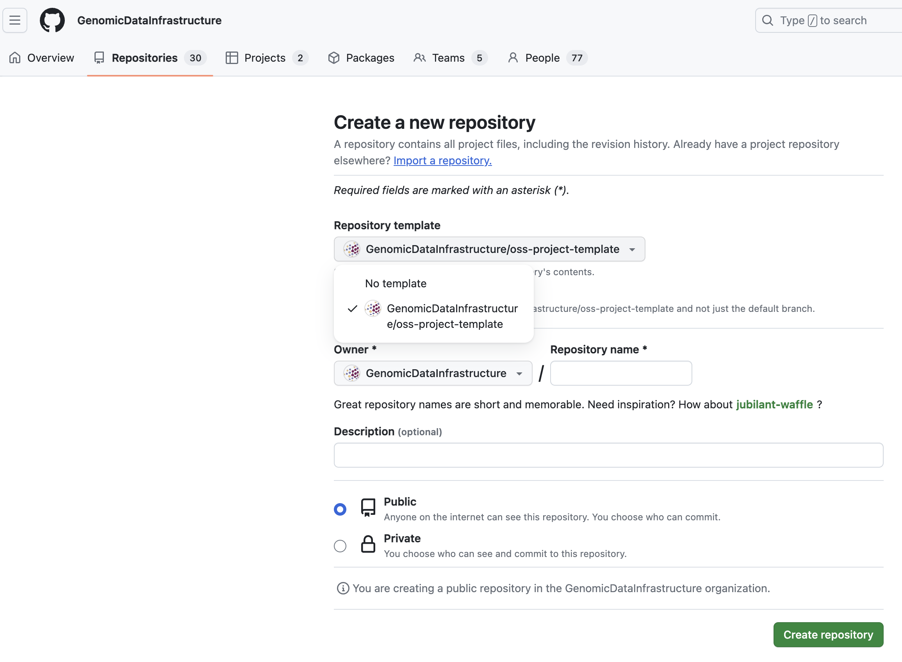

<!--
SPDX-FileCopyrightText: 2024 PNED G.I.E.

SPDX-License-Identifier: CC-BY-4.0
-->

# oss-project-template

This is a OSS project template. It suggests an initial setup for a successful open-source project.

## Software Development Guidelines

- We encourage the use of docker image to ship the code - GitHub offers free storage for open source projects.
- Testing is fundamental for stable and secure code.
- Follow free and Open Source Software principles:
    - Keep `CHANGELOG.md`, `README.md`, and `CONTRIBUTING.md` up to date.
    - Add license and copyrights to headers for each file - we suggest following [REUSE](https://reuse.software/).
    - Keep an issue tracker open for everyone.
    - Review regularly dependencies licenses and comply with all license requirements.
    - For more suggestions, please check [OpenSSF Best Practices](https://www.bestpractices.dev/en).
- Automated and recurrent CI/CD - GitHub offers a few thousand minutes per month.
- Quality checks are mandatory - SonarCloud is free for open-source projects.
- Vulnerability checks are mandatory - SonarCloud for code, ORT for dependencies, Trivy for packages and libraries inside docker images.

## CI/CD

There are three workflows available, `test.yml`, `main.yml`, and `release.yml`. 

In `test.yml` should go all kinds of tests, like: unit/integration tests, linters, prettiers, sonar, etc. This workflow should be fast and happen on every push.

In `main.yml` should go all kinds of checks that are still needed to enforce code quality, or license and security compliance checks. This workflow can be heavy, so it is advisable to happen only when the PR is open or when changes are merged to main. 

Similarly to the previous workflow, `release.yml` also should enforce code quality, license compliance, or security checks, that can be potentially heavy.

In this template, you will find jobs for [ORT](https://oss-review-toolkit.org/ort/), [REUSE](https://reuse.software/), [Trivy](https://trivy.dev/), and [GitHub Packages](https://docs.github.com/en/packages/working-with-a-github-packages-registry/working-with-the-docker-registry).

## Installation

## Usage

You will need to review the existing files, after you innitialised you project with this template.

- Search for TODO and replace dummy content by the correct value (e.g. links and repository names).
- Replace all references of `GenomicDataInfrastructure/oss-project-template` by your project repository.
- Keep `CHANGELOG.md` up to date, to reflect your deliveries.
- Update `CONTRIBUTING.md` to your project's needs, there are sessions to be fulfilled or simply removed.
- Update `README.md` to reflect your projects needs.
- Replace and add missing licenses accordingly.
- Review projects `README.md` badges.
- Register your open project in, if you want to get a `REUSE compliant` badge.

## Licenses

This work is licensed under multiple licences:
- All original source code is licensed under [Apache-2.0](./LICENSES/Apache-2.0.txt).
- All documentation and images are licensed under [CC-BY-4.0](./LICENSES/CC-BY-4.0.txt).
- For more accurate information, check the individual files.

## References
- https://fossid.com/blog/19-guidelines-for-free-and-open-source-software-usage/
- https://reuse.software/
- https://oss-review-toolkit.org/ort/
- https://www.sonarsource.com/products/sonarcloud/
- https://www.bestpractices.dev/en
- https://trivy.dev/
- https://docs.github.com/en/packages/working-with-a-github-packages-registry/working-with-the-docker-registry
